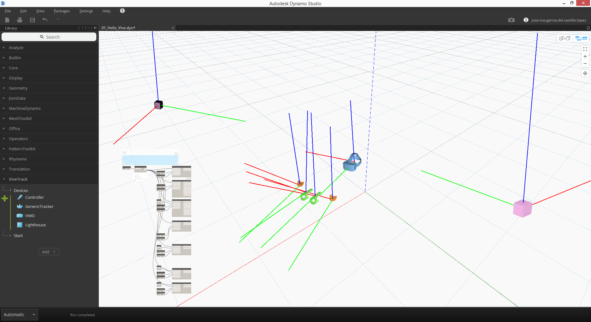
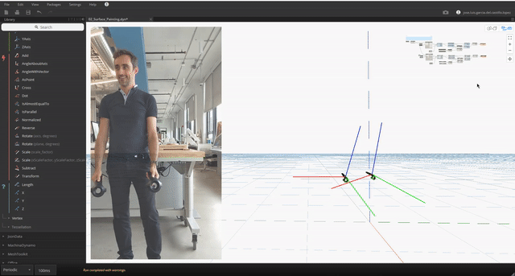

# ViveTrack-Dynamo

ViveTrack is [DynamoBIM](http://dynamobim.org/) package that allows real-time reading of HTC Vive spatial tracking data.

### Usage
If you have a working HTC Vive set, just download this package from Dynamo's package manager and look at the sample files.

In `01_Hello_Vive.dyn` you can find an example that tracks the position of all possible Vive objects and previews them in the background:

`02_Surface_Painting.dyn` uses controller tracking and trigger buttons to trace a series of lines in space and loft them into a surface, via the `DataRecorder` goodie:

### Acknowledgments
ViveTrack for Dynamo is a port from the [awesome project](https://github.com/ccc159/ViveTrack) by [Chen Jingcheng](https://github.com/ccc159). It is built using the [OpenVR](https://github.com/ValveSoftware/openvr) runtime.

This package was developed at the Generative Design Group at [Autodesk](https://www.autodesk.com).

Feel free to report issues and contribute.

